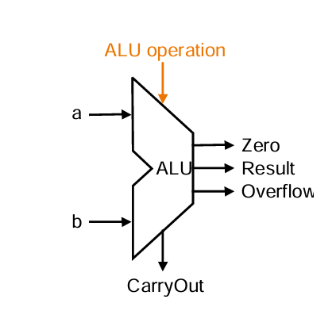
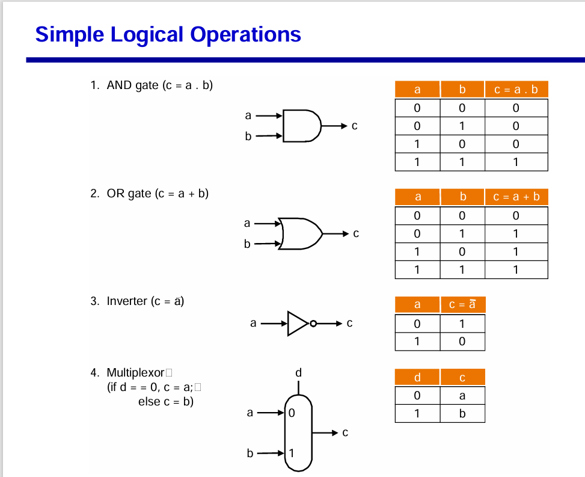
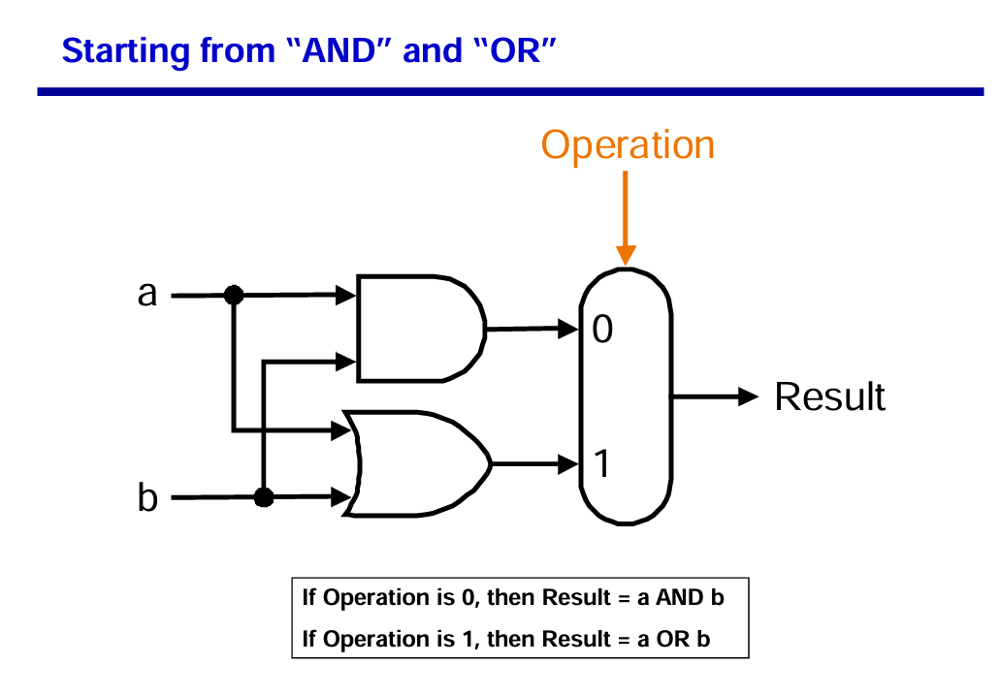
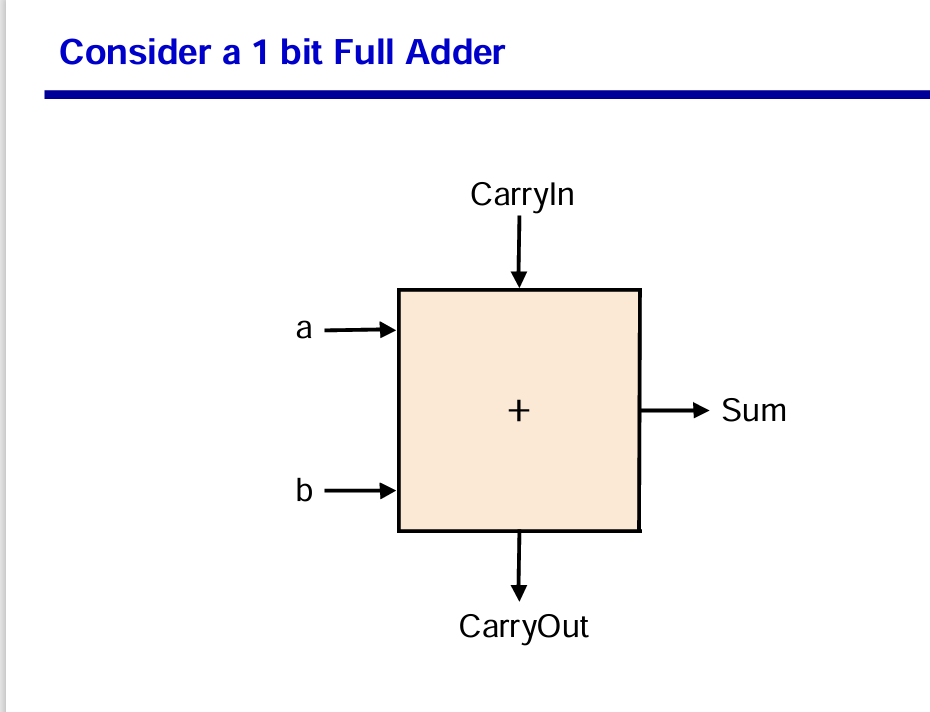
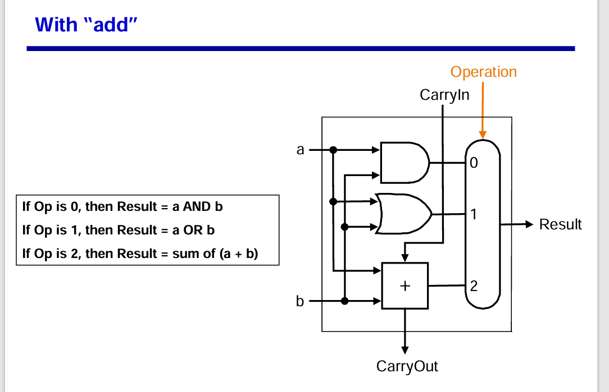
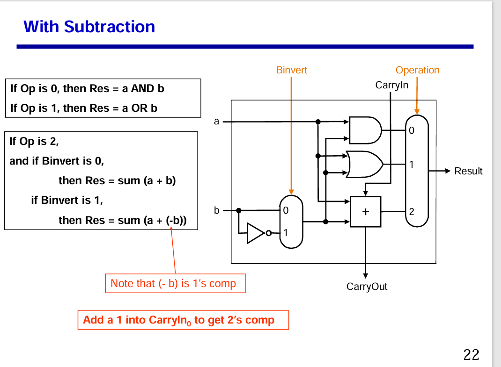

# ALU ( Arithmetic and Logic Unit):

## ALU block:

  

## Introduction to 1 bit ALU:
  

## Simple Logical Operation:
  

## Logical Unit:
  

## Arithmetic Unit:
  

## ALU block with Logical Unit and adder:
  

## ALU block with Logical Unit and adder and subtractor:
  

## Instruction ALU OPCODE ( My design specification)
The last bit of the code input acts as a mode selection for ALU. Remaining 3 are used for the ALU operation.

0000 - Mode 0, Arithmetic Unit for ADD

0001 - Mode 0, Arithmetic Unit for Subtrac

0010 - Mode 0, Arithmetic Unit for Division

0011 - Mode 0, Arithmetic Unit for Multiply

0100 - Mode 0, Arithmetic Unit for Increase

0101 - Mode 0, Arithmetic Unit for Decrease

0110 - Mode 0, Arithmetic Unit for Shift left

0111 - Mode 0, Arithmetic Unit for Shift right

1000 - Mode 1, Logical Unit for Compare

1001 - Mode 1, Logical Unit for AND

1010 - Mode 1, Logical Unit for OR

1011 - Mode 1, Logical XOR

1100 - Mode 1, Logical NOT A

1101 - Mode 1, Logical NOT B

------

# 8 bit ALU Specification:
## ALU 8 bit block summary:
  

In there:
- in_a[7:0] : value input a.
- in_b[7:0] : value input b.
- input_carry: value input carry to ALU
- alu_out[7:0]: output of ALU block.
- alu_out_flag: flag output of ALU block.

  

