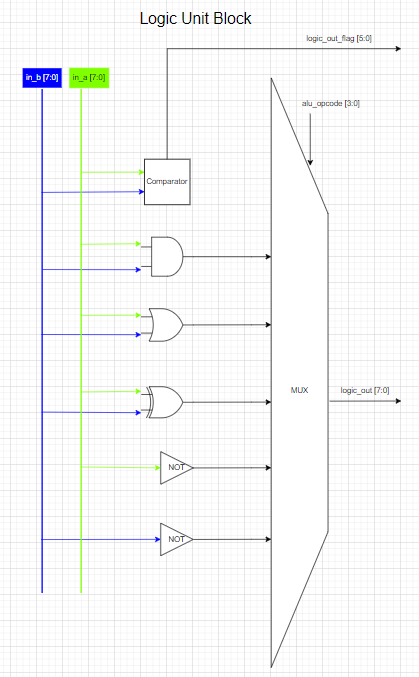

# ALU ( Arithmetic and Logic Unit):

## ALU block:

  

## Introduction to 1 bit ALU:
  

## Simple Logical Operation:
  

## Logical Unit:
  

## Arithmetic Unit:
  

## ALU block with Logical Unit and adder:
  

## ALU block with Logical Unit and adder and subtractor:
  

## Instruction ALU OPCODE ( My design specification)
The last bit of the code input acts as a mode selection for ALU. Remaining 3 are used for the ALU operation.

0000 - Mode 0, Arithmetic Unit for ADD

0001 - Mode 0, Arithmetic Unit for Subtrac

0010 - Mode 0, Arithmetic Unit for Division

0011 - Mode 0, Arithmetic Unit for Multiply

0100 - Mode 0, Arithmetic Unit for Increase

0101 - Mode 0, Arithmetic Unit for Decrease

0110 - Mode 0, Arithmetic Unit for Shift left

0111 - Mode 0, Arithmetic Unit for Shift right

1000 - Mode 1, Logical Unit for Compare

1001 - Mode 1, Logical Unit for AND

1010 - Mode 1, Logical Unit for OR

1011 - Mode 1, Logical XOR

1100 - Mode 1, Logical NOT A

1101 - Mode 1, Logical NOT B

------


# 8 bit ALU Specification (my design):
## ALU 8 bit block summary:
  

In there:
- in_a[7:0] : value input a.
- in_b[7:0] : value input b.
- input_carry: value input carry to ALU
- alu_out[7:0]: output of ALU block.
- alu_out_flag [5:0]: flag output of ALU block.
- 
Source code: CPU_package.sv
```SystemVerilog
package CPU_package;
  localparam DATA_WIDTH=8;
  localparam ADDRESS_WIDTH=10;
  localparam ADDRESS_MAX_WIDTH=2<<ADDRESS_WIDTH;

// ALU
localparam ALU_OPCODE=4;
typedef enum logic [ALU_OPCODE-1:0]{
      ALU_OP_ADD	//0000
    , ALU_OP_SUB	//0001
  	, ALU_OP_DIV	//0010
  	, ALU_OP_MUL	//0011
    , ALU_OP_INC	//0100
    , ALU_OP_DEC	//0101
    , ALU_OP_SHL	//0110
    , ALU_OP_SHR	//0111
  
    , ALU_OP_CPR	//1000
    , ALU_OP_AND	//1001
    , ALU_OP_OR		//1010
    , ALU_OP_XOR	//1011
    , ALU_OP_NOTA	//1100
  	, ALU_OP_NOTB	//1101
}enum_alu_opcode_t;

localparam ALU_FLAG_WIDTH = 5;
typedef struct packed {
    logic carry ;
    logic zero  ;
    logic equal ; // a=b
    logic larger; // a>b
    logic lower; // a<b
} struct_alu_flag_t;

endpackage: CPU_package
```
## ALU 8 bit high level specification:

  
-----
Source code: ALU

```SystemVerilog
// Code your design here
// Code your design here
`ifndef SYNTHESIS
    timeunit 1ps;
    timeprecision 1ps;
`endif
`include "CPU_package.sv"
`include "Arith_Unit.sv"
`include "Logic_Unit.sv"
import CPU_package::*;

module ALU (
    input logic [DATA_WIDTH-1:0] 	in_a,
	input logic [DATA_WIDTH-1:0] 	in_b,
	input logic 					input_carry,
	input  enum_alu_opcode_t 		alu_opcode,
  	output logic [DATA_WIDTH-1:0] 	alu_out,
  	output struct_alu_flag_t 		alu_out_flag
  	
);
  	logic [DATA_WIDTH-1:0] 			arith_out;
  	logic [DATA_WIDTH-1:0]			logic_out;
    logic [1:0]						arith_out_flag;
    logic [2:0]						logic_out_flag;	
  
   
  Arith arith_module(
        	.in_a(in_a),
            .in_b(in_b),
            .input_carry(input_carry),
            .alu_opcode(alu_opcode),
    		.arith_out(arith_out),
    		.arith_out_flag(arith_out_flag)
       );
  
  Logic logic_module(
        	.in_a(in_a),
            .in_b(in_b),
            .alu_opcode(alu_opcode),
            .logic_out(logic_out),
            .logic_out_flag(logic_out_flag)
       );
  
  always_comb	begin
    case(alu_opcode[3])
      1:	begin	
        alu_out=logic_out;
      	alu_out_flag=logic_out_flag;
      end
      0:	begin
        alu_out=arith_out;
      	alu_out_flag=arith_out_flag;
      end
    endcase
  end
endmodule
```

## Arith unit high level specification: 
  

Source Code: Arith unit block

```SystemVerilog
// `include "CPU_package.sv"
`ifndef SYNTHESIS
    timeunit 1ps;
    timeprecision 1ps;
`endif
`include "Full_Adder.sv"
`include "Full_Subtractor.sv"
`include "4_bit_multiple.sv"
import CPU_package::*;
module Arith 
(
    input logic [DATA_WIDTH-1:0] 	in_a,
	input logic [DATA_WIDTH-1:0] 	in_b,
	input logic  					input_carry,
	input  enum_alu_opcode_t 		alu_opcode,
  	output logic [DATA_WIDTH-1:0] 	arith_out,
  	output logic [1:0] 				arith_out_flag 
);
  logic [DATA_WIDTH-1:0] adder_out;
  logic adder_Cout;
  Full_Adder_by8 adder(.A(in_a),.B(in_b),.Cin(input_carry),.Cout(adder_Cout),.S(adder_out));
  logic [DATA_WIDTH-1:0] subtractor_out;
  logic subtractor_Bout;
  Full_Subtractor_by8 subtractor(.a(in_a),.b(in_b),.Bin(input_carry),.B(subtractor_Bout),.D(subtractor_out));
  logic [DATA_WIDTH-1:0] adder_1_out;
  logic adder_1_Cout;
  Full_Adder_by8 increase_1(.A(in_a),.B(1),.Cin(input_carry),.Cout(adder_1_Cout),.S(adder_1_out));
  logic [DATA_WIDTH-1:0] subtractor_1_out;
  logic subtractor_1_Bout;
  Full_Subtractor_by8 subtractor_1(.a(in_a),.b(1),.Bin(input_carry),.B(subtractor_1_Bout),.D(subtractor_1_out));
  logic [DATA_WIDTH-1:0] multiple_out;
  Multiple_4bit multiple(.X(in_a[3:0]),.Y(in_b[3:0]),.s(multiple_out));
  
always_comb	 begin: arith_proc
  		arith_out=0;
  		arith_out_flag='{default:0};
		case(alu_opcode)
		ALU_OP_ADD: begin
          {arith_out_flag,arith_out}={adder_Cout,adder_out};
		end
		ALU_OP_SUB: begin
          {arith_out_flag,arith_out}={subtractor_Bout,subtractor_out};
		end
        ALU_OP_DIV: begin
          {arith_out_flag,arith_out}=in_a/in_b;
        end
        ALU_OP_MUL: begin
          {arith_out_flag,arith_out}={multiple_out};
        end
        ALU_OP_INC: begin
          {arith_out_flag,arith_out}={adder_1_Cout,adder_1_out};
        end
        ALU_OP_DEC: begin
          {arith_out_flag,arith_out}={subtractor_1_Bout,subtractor_1_out};
        end
        ALU_OP_SHL: begin
          {arith_out_flag,arith_out} = {in_a[DATA_WIDTH-2:0], input_carry};
		end
        ALU_OP_SHR: begin
          {arith_out_flag,arith_out} = {input_carry, in_a[DATA_WIDTH-1:1]};
        end
          default:	begin
            arith_out=0;
  			arith_out_flag='{default:0};
          end
        endcase
	end: arith_proc
endmodule: Arith

```
## Logic Unit Block:
  

Souce code: Logic Unit Block

```SystemVerilog
// `include "CPU_package.sv"
`ifndef SYNTHESIS
    timeunit 1ps;
    timeprecision 1ps;
`include "Comparator.sv"
import CPU_package::*;
module Logic( 
    input logic [DATA_WIDTH-1:0] 	in_a,
	input logic [DATA_WIDTH-1:0] 	in_b,
	input  enum_alu_opcode_t 		alu_opcode,
  	output logic [DATA_WIDTH-1:0] 	logic_out,
  	output logic [2:0]				logic_out_flag 
);
  logic equal,lower,greater;
  Comparator_8bit comparator(.a(in_a),.b(in_b),.equal(equal),.lower(lower),.greater(greater));
  
  always_comb	begin
    
  		logic_out='0;
  		logic_out_flag='{default:0};
  
		case(alu_opcode)
            ALU_OP_CPR: begin
              logic_out_flag={greater,equal,lower};
            end
            ALU_OP_AND: begin
              logic_out=in_a&in_b;
            end
            ALU_OP_OR: begin
              logic_out=in_a|in_b;
            end
            ALU_OP_XOR: begin
             logic_out=in_a^in_b;
            end
            ALU_OP_NOTA: begin
              logic_out=~in_a;
            end
          	ALU_OP_NOTB: begin
              logic_out=~in_b;
            end
          default:	begin
            logic_out='0;
  			logic_out_flag='{default:0};
          end
        endcase
	end
endmodule: Logic

```

# Simulation:

## EPWAVE:
  

## Log file:
  

My code in EDA Playground: [ALU 8 bit Synthesis](https://edaplayground.com/x/LGC6)
